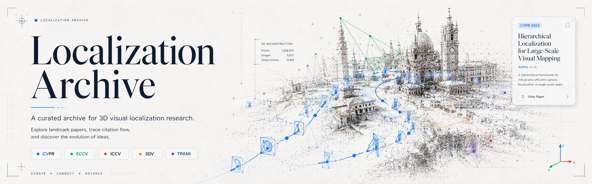

# 3D Localization Archive

An interactive archive for exploring 3D visual localization research as a connected lineage of papers, problems, datasets, and citations.

The goal is to make each paper easier to read in context: what problem it addressed, which prior limitation motivated it, where it was evaluated, what it improved, and how later work built on it.

## Features

- **Timeline archive**: browse papers by year with the newest work placed first.
- **Search and venue filters**: narrow the archive by paper title, contribution, dataset, or venue.
- **Paper detail cards**: inspect the problem, prior gap, contribution, datasets, metrics, limitations, and source links.
- **Citation graph**: view paper-to-paper citation flow and influence patterns in an interactive graph.
- **Paper comparison**: compare selected papers side by side across motivation, contribution, datasets, limitations, and links.
- **Consistent source slots**: each paper card exposes `Paper`, `Code`, and `Project` slots; unavailable links remain disabled instead of changing the layout.

## Scope

The archive focuses on 3D visual localization and closely related work:

- visual place recognition and image retrieval
- structure-based and hierarchical localization
- local features, dense matching, and correspondence learning
- absolute pose regression and scene coordinate regression
- long-term localization benchmarks
- privacy-preserving localization and map/query inversion risks

## Current Snapshot

- 80 curated papers
- 605 graph nodes
- 1326 graph edges
- normalized `Paper`, `Code`, and `Project` links

Paper links prioritize stable public archives such as CVF Open Access, ECVA, BMVA archive, NeurIPS proceedings, AAAI proceedings, and arXiv. Paper-to-paper citation edges are aligned against OpenAlex references when the reference list is available.
